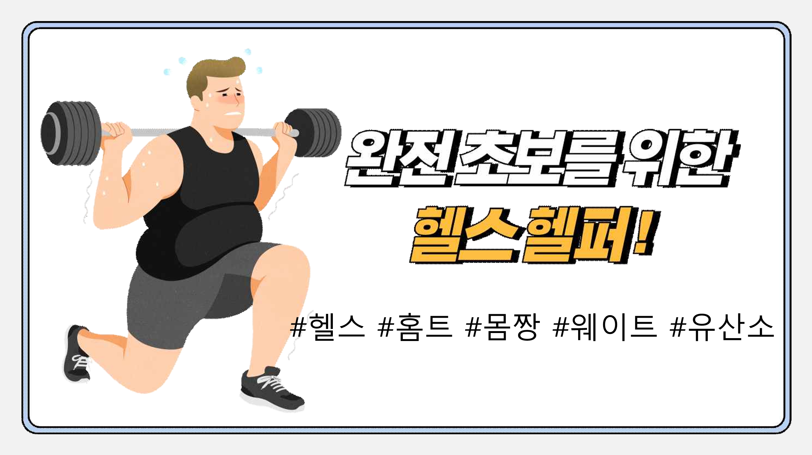

# 운동 자세 평가 및 분류 프로젝트

  <h2> <strong>프로젝트 표지</strong> </h2>

 

  <h2><strong>발표자료</strong></h2>

<ul>
  <li><a href="세종시발표.pdf">세종시 프로젝트 자료</a></li>
</ul>

 

  <h2><strong>프로젝트 개요</strong></h2>
  <li>이 프로젝트는 Mediapipe와 TSM 기반 딥러닝 모델을 활용하여 운동 자세를 분류하고 평가하는 시스템을 개발한 팀  프로젝트입니다.   </li>
  <li>본 프로젝트는 다양한 운동 자세를 평가하여 정확도를 개선하고, 사용자 맞춤형 피드백을 제공하는 것을 목표로  했습니다.  </li>

 

  <h2><strong>🛠 사용 기술 스택</strong></h2>
  <ul>
    <li><strong>언어</strong> : Python, DBeaver </li>
    <li><strong>라이브러리와 프레임워크 </strong>: pytorch, Mediapipe</li>
성</strong> : flask</li>  
  </ul>

 

  <h2><strong>프로젝트 내용</strong></h2>
  <ul>
    <li><strong>1.문제 정의</strong>
      <ul>
        <li>현대인의 운동 부족 문제 해결을 목표로 프로젝트 기획</li>
        <li>비만율 통계와 헬스 이용객 통계를 분석하여 운동 자세의 중요성을 확인</li>
      </ul>
    </li>
     
    <li><strong>2.데이터 설명</strong>
      <ul>
        <li><strong>활용 데이터:</strong>
          <ul>
            <li>운동 자세 이미지 데이터</li>
            <li>비만율 및 헬스 이용객 통계</li>
            <li>운동 관련 감정 분석 데이터</li>
          </ul>
        </li>
         
        <li><strong>데이터 수집 출처:</strong>
          <ul>
            <li>AI Hub</li>
            <li>KOSIS 국가통계포털</li>
            <li>네이버 블로그</li>
          </ul>
        </li>
      </ul>
    </li>
     
    <li><strong>3.데이터 분석</strong>
      <ul>
          <li>TSM(Temporal Shift Module) 기반 딥러닝 모델</li>
          <ul>
            <li>시간적 특성과 공간적 정보를 학습하여 운동 자세를 분류</li>
            <li>Confusion Matrix, ROC Curve, Precision, Recall, F1-Score로 성능 평가</li>
          </ul>
          <li>Mediapipe 활용
          <ul>
            <li>Mediapipe로 관절 좌표를 추출 후, 운동 분류 및 자세 평가</li>
            <li>추가로 Neck(목), Pelvis(골반), Spine(척추)의 좌표를 계산하여 자세 정밀도 향상</li>
          </ul>
      </ul>
    </li>
     
    <li><strong>4.모델 및 시연영상 구현</strong>
      <ul>
        <li>TSM 모델로 운동 자세 분류 및 평가 시연</li>
        <li>자세의 정확도 평가 기준</li>
      </ul>
    </li>
     
    <li><strong>5.홈페이지 생성</strong>
      <ul>
        <li>flask를 활용한 홈페이지 제작</li>
        <li>DBeaver 연동</li>
      </ul>
    </li>
  </ul>

 

  <h2><strong> 한계점</strong></h2>
  <ul>
    <li>대용량 데이터로 인해 서버와 메모리 자원의 부족</li>
    <li>데이터 분석 및 학습 시간 부족</li>
  </ul>

